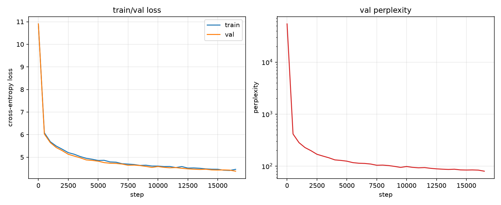

# rumik assignment — GPT-2, no autograd

A GPT-2-style decoder-only transformer, trained on OpenWebText, with **every gradient
hand-derived and hand-coded** — no `torch.autograd`, no `jax.grad`, no autograd engine
of any kind. Built on NumPy for correctness (finite-difference-checked) and CuPy for
real GPU training on a DGX Spark (GB10), with the exact same code running on both —
one `xp` backend switch, nothing else changes.

Full design rationale and decision log: [REASONING.md](REASONING.md).
In-depth codebase walkthrough with architecture diagrams and a real-sentence
shape trace: [docs/gpt2_explainer.html](docs/gpt2_explainer.html).

## Approach

Two ways to satisfy "no autograd" were on the table: (1) hand-derive and hand-code
the backward pass for every layer, or (2) write a small tensor autograd engine and
let it compose backward passes automatically. This project takes **route 1**. Every
layer in [`src/nanograd_gpt/layers.py`](src/nanograd_gpt/layers.py) is a class with
an explicit `forward()` and a separately hand-derived `backward()` — no computation
graph, no tape, no generic `Tensor.backward()`. The "graph" is just the fixed Python
composition order in [`model.py`](src/nanograd_gpt/model.py).

Correctness is verified independently, not just asserted: every hand-derived backward
is checked against central-difference numerical gradients in
[`tests/test_gradients.py`](tests/test_gradients.py), matching to ~1e-10 on float64,
for every layer individually and for the full wired-together model (catching wiring
bugs — e.g. the weight-tying gradient merge — that per-layer checks alone can't see).

A second, fully pure-function rewrite with **zero classes** — every function takes
plain arrays and an explicit `xp` (numpy/cupy) argument, nothing hidden on `self` —
lives in [`src/nanograd_gpt/simple.py`](src/nanograd_gpt/simple.py), kept purely as
a from-scratch teaching reference alongside the class-based version actually used for
training.

## Architecture

Standard pre-norm GPT-2, matching OpenAI's architecture choices exactly (see the
[explainer](docs/gpt2_explainer.html) for line-by-line derivations and shape traces):

- Learned token embeddings (`wte`) + learned absolute position embeddings (`wpe`), summed
- `n_layer` × pre-norm transformer block: `x + Attn(LN(x))`, then `x + MLP(LN(x))`
- Causal multi-head self-attention, scaled dot-product, additive `-inf` mask
- MLP: `Linear(C,4C) → GELU(tanh-approx) → Linear(4C,C)`
- Final LayerNorm, then an output projection **weight-tied** to `wte` (no separate head)
- Softmax cross-entropy on next-token prediction
- AdamW optimizer (decoupled weight decay, skipped on 1-D params), cosine LR schedule with warmup
- Dropout (embedding/attention/residual) and the GPT-2-paper `1/√(2·n_layer)`
  residual-projection init scaling are implemented and gradient-checked; see
  **Known limitations** below for what this specific training run does and doesn't
  benefit from.

### Config trained

| | |
|---|---|
| n_layer | 6 |
| n_head | 6 |
| n_embd | 384 |
| block_size | 256 |
| vocab_size | 50,304 (GPT-2's 50,257, padded for tensor-friendly shapes) |
| parameters | 30,062,592 |

Scaled down from real GPT-2-small (12/12/768/1024, 124M params) to fit a multi-hour
training budget on hand-written, non-kernel-fused NumPy/CuPy ops — see
[REASONING.md §7](REASONING.md) for the throughput measurements behind that choice
(the 124M config was benchmarked too: ~3,676 tok/s vs. this config's ~17,000 tok/s).

## Dataset

[Skylion007/openwebtext](https://huggingface.co/datasets/Skylion007/openwebtext) — 2 of
its 80 parquet shards (~100K documents each), BPE-tokenized with `tiktoken`'s GPT-2
encoding. Not the full ~9B-token corpus; a subset sized to what GB10 throughput
supports in a few hours (see `scripts/prepare_openwebtext.py`).

| | |
|---|---|
| train tokens | 227,150,260 |
| val tokens | 110,062 |

## Results

Training was run on a DGX Spark (GB10) via CuPy and manually stopped at **step
16,500 / 28,000** (~59% of the planned run, ~423M tokens processed at ~17,000 tok/s
sustained) to free the GPU for other work — not a full run to convergence.



| metric | value |
|---|---|
| train loss (step 16,500) | 4.4629 |
| val loss (step 16,500) | 4.3808 |
| val perplexity (step 16,500) | 79.90 |
| **WikiText-2 (raw, test) perplexity** — checkpoint @ step 16,000 | **271.09** |
| WikiText-2 cross-entropy | 5.6025 |
| WikiText-2 tokens evaluated | 283,136 |

The WikiText-2 number is meaningfully higher than the OpenWebText validation
perplexity, as expected — WikiText-2 (Wikipedia prose) is a genuinely different
distribution from OpenWebText's broad web text, so this is a real
out-of-distribution generalization measurement, not a bug.

Loss was still decreasing steadily with no sign of overfitting when the run was
stopped — these numbers reflect an under-trained checkpoint at ~59% of the planned
token budget, not a converged model.

## Known limitations

- **Dropout** is implemented and gradient-checked (`Dropout` in `layers.py`, wired
  into embeddings/attention/residual branches) but this run used the default `p=0.0`
  — nanoGPT's own pretraining convention, dropout mainly matters for finetuning — so
  it had no effect on this run's numbers either way.
- **Residual-projection init scaling** (`1/√(2·n_layer)` on `c_proj`/`mlp.proj`,
  matching the GPT-2 paper's variance-control trick) is implemented and verified, but
  landed in the code *after* this run had already started and initialized its weights
  with the older uniform-std init. It could not be applied retroactively without
  discarding the run's progress, so this specific checkpoint does not benefit from it
  — a fresh run would.
- Run was stopped manually at 59% of its planned step budget by choice, not due to
  any failure — see the loss curve for the trend it was on.

## Repo layout

```
REASONING.md              design rationale, decisions, roadblock log
docs/gpt2_explainer.html  architecture diagrams + real-sentence shape trace
src/nanograd_gpt/
  backend.py              numpy/cupy switch (get_xp, scatter_add)
  param.py                Param: array + gradient buffer
  layers.py                Linear, LayerNorm, GELU, Embedding, Dropout,
                           CausalSelfAttention, MLP, Block -- each hand-coded
                           forward()/backward()
  model.py                GPTConfig, GPT (assembly + weight tying)
  optim.py                AdamW, cosine LR schedule
  simple.py                same architecture, zero classes, pure functions
tests/test_gradients.py   numerical gradient checks, every layer + full model
scripts/
  prepare_openwebtext.py  data download + BPE tokenization -> .bin shards
  train.py                training loop (data loading, schedule, checkpointing)
  bench_throughput.py     GB10 tokens/sec measurement
  overfit_one_batch.py    sanity check: tiny model should drive loss to ~0
  plot_history.py         loss/perplexity plots from out/history.json
  eval_wikitext2.py       downstream LM benchmark
out/
  history.json, loss_curves.png, wikitext2_eval.json, train.log
```

`out/*.npz` (checkpoints) and `data/*/*.bin` (tokenized shards) are gitignored —
regenerate with `scripts/prepare_openwebtext.py` and `scripts/train.py`.

## Reproducing

```bash
uv venv .venv && source .venv/bin/activate
uv pip install numpy tiktoken tqdm matplotlib requests datasets huggingface_hub pyarrow
uv pip install cupy-cuda13x   # or the cuda12x build matching your driver, for GPU training

python tests/test_gradients.py                       # verify the hand-derived gradients
python scripts/prepare_openwebtext.py --num-shards 2
python scripts/train.py --device cuda --n-layer 6 --n-head 6 --n-embd 384 \
    --block-size 256 --batch-size 32 --max-steps 28000
python scripts/plot_history.py
python scripts/eval_wikitext2.py --ckpt out/ckpt_<N>.npz --device cuda \
    --n-layer 6 --n-head 6 --n-embd 384 --block-size 256
```
