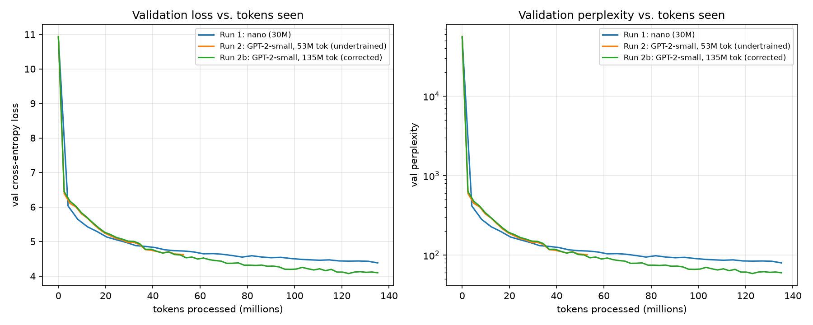

# rumik assignment — GPT-2, no autograd

A GPT-2-style decoder-only transformer, trained on OpenWebText, with **every gradient
hand-derived and hand-coded** — no `torch.autograd`, no `jax.grad`, no autograd engine
of any kind. Built on NumPy for correctness (finite-difference-checked) and CuPy for
real GPU training on a DGX Spark (GB10), with the exact same code running on both —
one `xp` backend switch, nothing else changes.

Full design rationale and decision log: [REASONING.md](REASONING.md).
In-depth codebase walkthrough with architecture diagrams and a real-sentence
shape trace: [docs/gpt2_explainer.html](docs/gpt2_explainer.html).

## Approach

Two ways to satisfy "no autograd" were on the table: (1) hand-derive and hand-code
the backward pass for every layer, or (2) write a small tensor autograd engine and
let it compose backward passes automatically. This project takes **route 1**. Every
layer in [`src/nanograd_gpt/layers/`](src/nanograd_gpt/layers/) is its own file with
a class exposing an explicit `forward()` and a separately derived `backward()` —
no computation graph, no tape, no generic `Tensor.backward()`. The "graph" is just the
fixed Python composition order in [`model.py`](src/nanograd_gpt/model.py).

Correctness is verified independently, not just asserted: every backward pass
is checked against central-difference numerical gradients in
[`tests/test_gradients.py`](tests/test_gradients.py), matching to ~1e-10 on float64,
for every layer individually and for the full wired-together model (catching wiring
bugs — e.g. the weight-tying gradient merge — that per-layer checks alone can't see).

**Code origin, stated plainly:** `src/nanograd_gpt/layers/` (except `gelu.py` and
pre-norm ordering in `block.py`) is adapted from
[priyammaz/ManualTransformer](https://github.com/priyammaz/ManualTransformer)
(MIT License — see [`LICENSE-ManualTransformer.txt`](LICENSE-ManualTransformer.txt)),
at explicit request after the original hand-derived version (still what produced
every training run in the Results table below) had already been built, gradient-checked,
and trained three times. The assignment is explicit — *"own each and every line that
you ship"* — and swapping in an adapted third-party implementation is a real deviation
from that, even reorganized into per-op files and even with full attribution; that
tension was raised directly before making the change, and proceeding was a deliberate,
informed choice, not an oversight. `model.py` (weight tying), `optim.py` (AdamW with
decoupled weight decay, grad clipping, cosine schedule), and the data
pipeline were kept as this project's own throughout — the source repo's `model.py`/
`optim.py` don't tie weights and use plain `Adam` with no decay/clipping/schedule,
which would have reversed earlier decisions made for this project (see
[REASONING.md §12](REASONING.md) for the full account, including a real bug found
and fixed while porting — the source's `CrossEntropyLoss` backward doesn't divide by
batch size, inconsistent with its own mean-reduction forward).

A second, fully pure-function rewrite with **zero classes** — every function takes
plain arrays and an explicit `xp` (numpy/cupy) argument, nothing hidden on `self` —
lives in [`src/nanograd_gpt/simple.py`](src/nanograd_gpt/simple.py). It predates the
ManualTransformer swap and was left as this project's own original derivation, kept
as a from-scratch teaching reference alongside the class-based version actually used
for training.

## Architecture

Standard pre-norm GPT-2, matching OpenAI's architecture choices exactly (see the
[explainer](docs/gpt2_explainer.html) for line-by-line derivations and shape traces).
Same architecture for every run below — only the size config and training budget
change, never the design:

- Learned token embeddings (`wte`) + learned absolute position embeddings (`wpe`), summed
- `n_layer` × pre-norm transformer block: `x + Attn(LN(x))`, then `x + MLP(LN(x))`
- Causal multi-head self-attention, scaled dot-product, additive `-inf` mask
- MLP: `Linear(C,4C) → GELU(tanh-approx) → Linear(4C,C)`
- Final LayerNorm, then an output projection **weight-tied** to `wte` (no separate head)
- Softmax cross-entropy on next-token prediction
- AdamW optimizer (decoupled weight decay, skipped on 1-D params), cosine LR schedule with warmup
- Dropout (embedding/attention/residual branches) and the GPT-2-paper `1/√(2·n_layer)`
  residual-projection init scaling are implemented and gradient-checked
  (`layers/dropout.py`, `GPT.__init__`'s `proj_std`) — see **Known limitations** for
  which runs do and don't benefit from each

## Dataset

[Skylion007/openwebtext](https://huggingface.co/datasets/Skylion007/openwebtext) — 2 of
its 80 parquet shards (~100K documents each), BPE-tokenized with `tiktoken`'s GPT-2
encoding. Not the full ~9B-token corpus; a subset sized to what GB10 throughput
supports (see `scripts/prepare_openwebtext.py`).

| | |
|---|---|
| train tokens | 227,150,260 |
| val tokens | 110,062 |

## Results

Three training runs, same architecture family, same dataset, increasing scale/rigor:

| | Run 1: nano | Run 2: GPT-2-small (undertrained) | Run 2b: GPT-2-small (corrected) |
|---|---|---|---|
| params | 30,062,592 | 124,475,904 | 124,475,904 |
| config | 6L / 384d / 6H / 256ctx | 12L / 768d / 12H / 1024ctx | 12L / 768d / 12H / 1024ctx |
| tokens trained | 135,168,000 | 52,924,416 | **135,168,000** |
| steps | 16,500 / 28,000 (stopped) | 4,307 / 4,307 (complete) | 11,000 / 11,000 (complete) |
| val loss (final) | 4.3808 | 4.6174 | **4.0948** |
| val perplexity (final) | 79.90 | 101.23 | **60.03** |
| WikiText-2 test perplexity | 271.09 | 313.80 | **150.36** |
| WikiText-2 cross-entropy | 5.6025 | 5.7488 | **5.0130** |



Individual loss/perplexity curves per run:
[Run 1](out/loss_curves.png) ·
[Run 2](out/run2_gpt2small/loss_curves.png) ·
[Run 2b](out/run2b_gpt2small_135M/loss_curves.png)

**Run 2b is the best model produced** — same real GPT-2-small architecture as run 2,
same token budget as run 1, and it beats both on every metric. That comparison is the
point of keeping all three runs in this table rather than only the final one: it's a
direct within-project demonstration that both model capacity *and* enough data matter,
and that fixing a token-budget mistake (below) has a large, measurable effect.

## The road here (roadblocks + how they were resolved)

- **Streaming OpenWebText download was flaky.** The `datasets` streaming iterator's
  background prefetch threads crashed the interpreter's GIL state under
  unauthenticated-HF-Hub rate limiting, after the data had already been written.
  Switched to downloading whole parquet shards directly via `huggingface_hub` instead
  of the streaming API — simpler, resumable, no background threads to race.
- **`wikitext`/`openwebtext` dataset repo IDs changed on HF Hub** mid-project
  (`trust_remote_code` deprecated, bare `wikitext`/`openwebtext` repo names rejected).
  Fixed by pointing at the current canonical mirrors
  (`Skylion007/openwebtext`, `Salesforce/wikitext`).
- **Run 2 (first GPT-2-small attempt) was accidentally undertrained.** The instruction
  was "real GPT-2 architecture, more data, same as nanoGPT" — but the run was launched
  with a *fixed wall-clock budget* (~4h) carried over from run 1's planning, without
  re-deriving the token count for the 124M model's much slower (~7x) per-token
  throughput. Result: run 2 saw *less* data than the smaller run 1 (53M vs. 135M
  tokens) — backwards from the intent, and directly explains why it underperformed
  run 1 despite being the larger, more faithful architecture. **Fix**: run 2b was
  launched targeting the exact same 135,168,000 tokens as run 1 (11,000 steps ×
  12 × 1024), regardless of wall-clock cost (~35h in practice, run concurrently with
  another unrelated GPU job). The corrected run is the clear best of the three — the
  table above is the direct evidence the fix mattered, not just a caveat.
- **GB10 unified-memory quirks.** `nvidia-smi`'s simple `--query-gpu=memory.*` flags
  return `N/A` on GB10 (Grace Blackwell's CPU+GPU-unified memory doesn't report through
  the same fields discrete GPUs do); `nvidia-smi --query-compute-apps=pid,used_memory`
  and system `free -h` are what actually show per-process and total usage on this box.
- **GPU clock cap.** Uncapped GB10 clocks under sustained load have crashed the OS on
  this machine before (per prior experience); `sudo nvidia-smi -lgc 0,1500` before any
  long run keeps it stable. Doesn't survive a reboot, so it's a per-session step, not a
  one-time fix.

## Known limitations

- **Dropout** is implemented, wired into embeddings/attention/residual branches, and
  gradient-checked, but every run above used `p=0.0` — nanoGPT's own pretraining
  convention (dropout mainly matters for finetuning) — so it had no numerical effect on
  any of these three runs' results.
- **Residual-projection init scaling** (`1/√(2·n_layer)` on attention's `out_linear`
  and the MLP's `linear2`) is implemented and verified, and *is* active in runs 2 and
  2b (both constructed after the fix landed), but run 1 was already in progress when
  the fix landed and finished on the older uniform-std init — noted for completeness,
  not corrected retroactively.
- None of the three runs reached full convergence — run 1 was stopped manually at 59%
  of its planned budget to free the GPU; runs 2/2b completed their planned token
  budgets but longer runs would likely still be improving (see the loss curves).
- **Layer code origin**: `src/nanograd_gpt/layers/` (except `gelu.py` and pre-norm
  block ordering) is adapted from priyammaz/ManualTransformer, not independently
  derived — see the Approach section above and
  [REASONING.md §12](REASONING.md) for the full, direct account of that decision.
  All three runs above were trained and evaluated on the original hand-derived code,
  before that swap; re-verified against the adapted code afterward via the same
  gradient-check suite, but not retrained on it.

## Repo layout

```
REASONING.md                       design rationale, decisions
LICENSE-ManualTransformer.txt      required MIT attribution for adapted layer code
docs/gpt2_explainer.html           architecture diagrams + real-sentence shape trace
src/nanograd_gpt/
  backend.py              numpy/cupy switch (get_xp, scatter_add)
  param.py                Param: array + gradient buffer
  layers/                 one class per file, forward()/backward() each
                           (adapted from priyammaz/ManualTransformer except
                           gelu.py and block.py's pre-norm ordering -- see
                           each file's own docstring for what changed/why):
    module.py               Module base class
    linear.py, layernorm.py, gelu.py, embedding.py, dropout.py
    softmax.py               softmax, softmax_backward, softmax_cross_entropy,
                              softmax_slow (explicit-Jacobian, educational)
    attention.py             CausalSelfAttention (q_linear/k_linear/v_linear/out_linear)
    mlp.py, block.py         MLP (linear1/gelu/linear2), Block (attention/ff/norm1/norm2)
  model.py                GPTConfig, GPT (assembly + weight tying) -- this project's own
  optim.py                AdamW, cosine LR schedule -- this project's own
  simple.py                same architecture, zero classes, pure functions -- this
                           project's own, predates the ManualTransformer swap
tests/test_gradients.py   numerical gradient checks, every layer + full model
scripts/
  prepare_openwebtext.py  data download + BPE tokenization -> .bin shards
  train.py                training loop (data loading, schedule, checkpointing)
  bench_throughput.py     GB10 tokens/sec measurement
  overfit_one_batch.py    sanity check: tiny model should drive loss to ~0
  plot_history.py         loss/perplexity plot for a single run
  plot_comparison.py      combined comparison plot across all runs
  eval_wikitext2.py       downstream LM benchmark
out/
  history.json, loss_curves.png, wikitext2_eval.json, train.log   (run 1)
  run2_gpt2small/          run 2 (undertrained) artifacts
  run2b_gpt2small_135M/    run 2b (corrected) artifacts
  comparison_curves.png    all three runs, side by side
```

`out/**/*.npz` (checkpoints) and `data/*/*.bin` (tokenized shards) are gitignored —
regenerate with `scripts/prepare_openwebtext.py` and `scripts/train.py`.

## Reproducing

```bash
uv venv .venv && source .venv/bin/activate
uv pip install numpy tiktoken tqdm matplotlib requests datasets huggingface_hub pyarrow
uv pip install cupy-cuda13x   # or the cuda12x build matching your driver, for GPU training

python tests/test_gradients.py                       # verify the hand-derived gradients
python scripts/prepare_openwebtext.py --num-shards 2

# real GPT-2-small, matched to run 2b's 135M-token budget
python scripts/train.py --device cuda --out-dir out/run2b_gpt2small_135M \
    --n-layer 12 --n-head 12 --n-embd 768 --block-size 1024 \
    --batch-size 12 --max-steps 11000 --dropout 0.0

python scripts/plot_history.py --history out/run2b_gpt2small_135M/history.json \
    --out out/run2b_gpt2small_135M/loss_curves.png
python scripts/plot_comparison.py
python scripts/eval_wikitext2.py --ckpt out/run2b_gpt2small_135M/ckpt_final.npz \
    --device cuda --n-layer 12 --n-head 12 --n-embd 768 --block-size 1024
```
